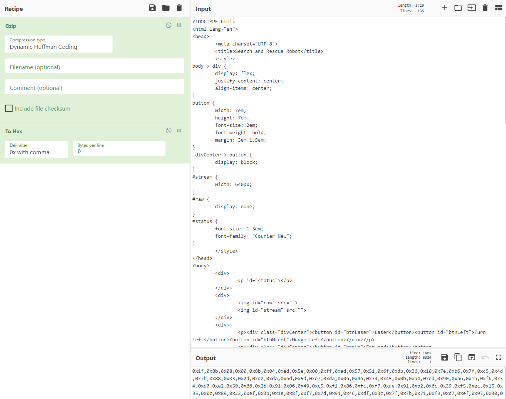
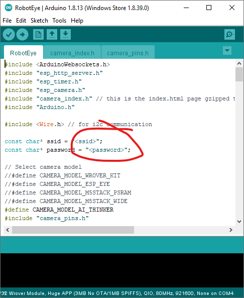
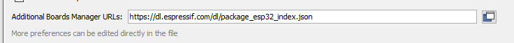
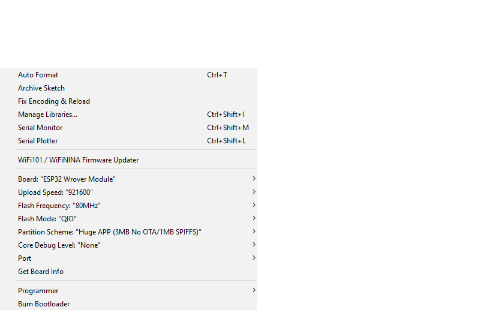
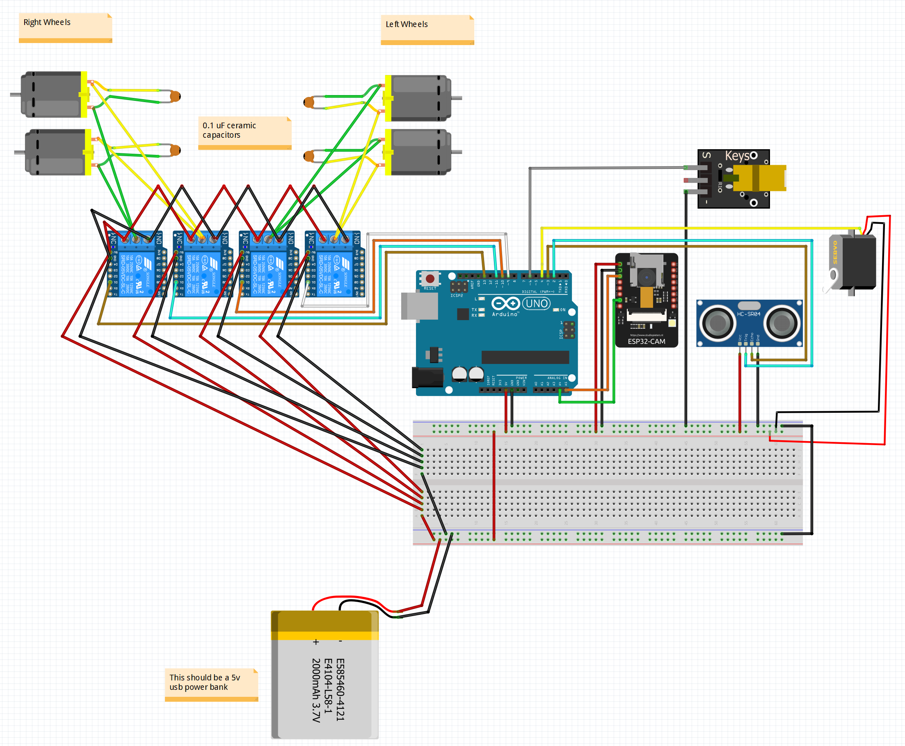
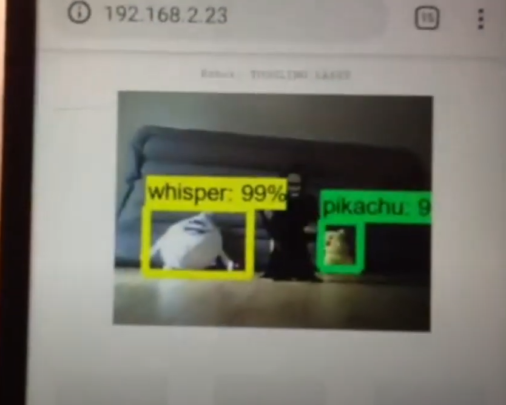

# Search-and-Rescue-Robot
A project for my mechatronics class in NBCC

Click on the image below for an overview

## Parts

- Arduino Uno
- ESP32-Cam microcontroller
- Robot Car Chassis with 4x DC motors and gearboxes (without motor driver circuitboard)
- 4-channel relay
- USB Power Bank
- Laser Module
- Ultrasonic Sensor
- Micro servo
- Ceramic capacitors
- Foam dart gun
- Breadboard

## Installation

### Step 1

Follow the steps in this YouTube tutorial by Edje Electronics

on how to create a Tensorflow v1 environment and train an object detection model to be able to recognize your "search targets".

Note: I found that running `conda install tensorflow-gpu=1.15.0` is a quick shortcut to setting up your tensorflow environment. No need to install CUDA or cuDNN, etc.

### Step 2

Copy `object_detection_server.py` from this project into your `tensorflow/models/research/object_detection` folder and run it.

### Step 3

Modify `Arduino/RobotEye/index.html` and replace the values for cam_ws and ai_ws with the intended IP addresses of your robot server and object detection server.

This `index.html` will serve as the "remote control" or UI of the robot. You have two options on where to host this html file:

#### Option 1 - Hosting the UI on the image detection server

Just copy the modified file over to the same location where you copied `object_detection_server.py` which is your `tensorflow/models/research/object_detection` folder.

#### Option 2 - Hosting the UI on the robot itself

This step is a bit more involved. First, compress all the text content of the modified `index.html` using gzip and encode it in a comma-separated hex (0x00) format. You can do this easily using [CyberChef](https://gchq.github.io/CyberChef).

Then, modify the `Arduino/RobotEye/camera_index.h` and replace all the hex code with the output from CyberChef. Don't forget to change the value of `index_ov2640_html_gz_len` to the number of hex codes you got. (I usually just paste all the hex code in Notepad++ and find the last column and divide by 5.)

#### Bonus Option - Do both options

### Step 4

Modify `Arduino/RobotEye/RobotEye.ino` by putting your wi-fi SSID and password into the code.

Make sure you have the ESP32 boards installed in the Arduino IDE. If not, go to `File-Preferences` and make sure `https://dl.espressif.com/dl/package_esp32_index.json` is included under `Additional Boards Manager URLs`.

Upload `Arduino/RobotEye/RobotEye.ino` to the ESP32-Cam. Use ESP32 Wrover Module as the board when uploading. Try to use a partition with a high enough space for the app. "Huge App" works fine.

If you do not have an FTDI programmer or any other way to upload code to the ESP32-Cam. Refer to the tutorial below on how to program the ESP32-Cam using just the Arduino Uno.

https://create.arduino.cc/projecthub/PMGOHARIAN/setting-up-esp-cam-with-arduino-no-more-usb-ttl-35467a

### Step 5

Upload `Arduino/RobotEngine/RobotEngine.ino` to the Arduino Uno.

### Step 6

Wire everything up using the Fritzing diagram in `Docs\Search_and_Destroy_Robot.fzz`

### Step 7

Navigate to wherever you hosted the "Remote Control" UI html page from step 3 using your browser and enjoy searching and rescuing.

